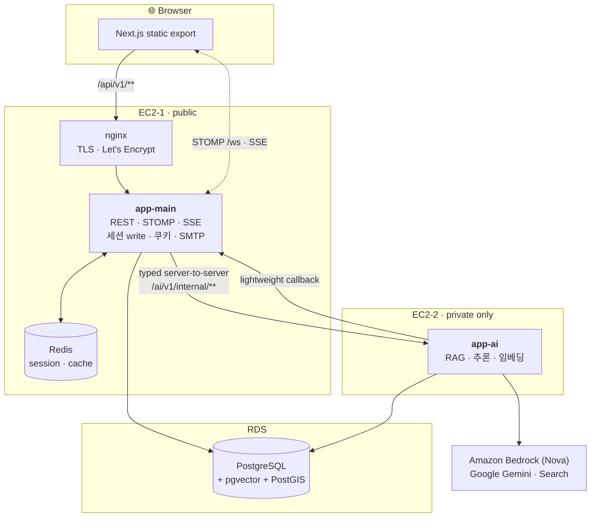
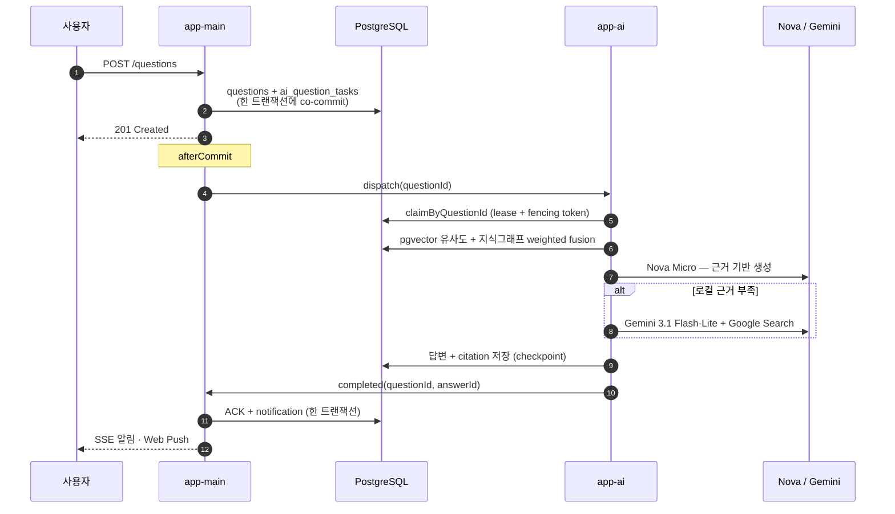
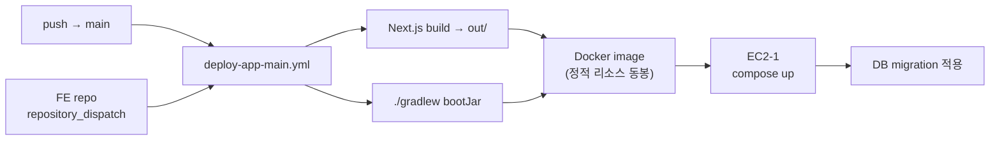

<div align="center">

# 이음 · Ieum — Backend

### 위치 기반 커뮤니티를 떠받치는 2-서버 아키텍처

REST · WebSocket · SSE를 맡는 **app-main**과, RAG 추론을 맡는 **app-ai**.<br/>
하나의 저장소, 하나의 도메인 모델, 서로 다른 두 대의 EC2.

<br/>

[](https://ieum.rktclgh.site)
[](https://github.com/rktclgh/Vivisa_Plus_FE)

<br/>

</div>

## Tech Stack

<div align="center">

**Core**


**Data**


**AI**


**Infra**


</div>

<br/>

## 아키텍처



### 왜 서버를 둘로 나눴나

| 서버 | 담당 | 부하 성격 |
|---|---|---|
| **EC2-1** `app-main` | REST + WebSocket + SSE | 지속 커넥션 다수 유지 → **CPU/RAM 상주** |
| **EC2-2** `app-ai` | AI 추론 · RAG · 임베딩 | 외부 API 호출 · 스파이크 → **버스티** |

한 프로세스에 두면 AI 스파이크가 채팅 커넥션을 굶긴다. 그래서 **다른 jar → 다른 서버**로 격리했다.
다만 도메인 모델은 양쪽이 공유하므로 저장소를 쪼개지 않고 `common` 모듈로 묶었다.

### 경계 규칙 (타협 없음)

```
브라우저 ──▶ app-main /api/v1/**          ✅  쿠키 인증
브라우저 ──▶ app-ai                        ❌  public 노출 금지, 쿠키 전달 금지
app-main ──▶ app-ai /ai/v1/internal/**    ✅  private origin, typed client
app-ai   ──▶ Redis · 세션 · SSE            ❌  app-ai는 세션을 만지지 않는다
```

`app-ai`는 **AI 판단과 AI 파생 데이터만** 생성한다. 유저·신고·제재 같은 도메인 정본과 상태 변경은 전부 `app-main`의 책임이다. app-ai가 `suspend`를 반환해도, 실제 제재를 집행하는 건 app-main 코드다.

<br/>

## 모듈

```
ieum_be/
├─ common/        📚 라이브러리 — 엔티티 · Repository · 공용 DTO · 세션 검증 코어
├─ app-main/      🚀 EC2-1 — REST · WebSocket · SSE · 인증 · S3 · 메일
└─ app-ai/        🤖 EC2-2 — RAG · 임베딩 · 신고 판단
```

```
app-main ──┐
           ├──▶ common       (한 방향. common은 절대 app-*를 import 하지 않는다)
app-ai  ───┘
```

| 모듈 | 산출물 | 주요 의존성 |
|---|---|---|
| `common` | 일반 jar (`bootJar` off) | Data JPA, Validation, Jackson · testFixtures로 Testcontainers 지원 |
| `app-main` | `app-main.jar` | webmvc, websocket, security, oauth2-jose, data-redis, mail, AWS S3, scrimage(WebP), webpush, springdoc |
| `app-ai` | `app-ai.jar` | Spring AI 2.0 (Bedrock Converse), google-genai, jdbc, springdoc |

`common`은 각 앱 jar 안에 함께 패키징된다(`BOOT-INF/lib/common-*.jar`). 서버에 올라가는 건 **jar 하나**뿐이다.

> **패키지 규칙** — 두 실행 모듈의 메인 클래스는 모두 루트 패키지 `shinhan.fibri.ieum`에 둔다. 그래야 컴포넌트·엔티티·Repository 스캔이 기본값으로 `common`까지 커버해서 `@EntityScan`/`@EnableJpaRepositories`를 따로 쓸 필요가 없다.

<br/>

## AI 파이프라인

질문이 올라오면 AI가 먼저 답한다. 채택된 사람 답변은 다시 지식이 된다.



| 용도 | 모델 | 비고 |
|---|---|---|
| 질문 답변 생성 | **Amazon Nova Micro** | Bedrock Converse · `ap-southeast-2` |
| 신고 내용 판단 | **Amazon Nova Lite** | 정책 테이블 기반 결정론적 평가와 결합 |
| Fallback · 웹 그라운딩 | **Gemini 3.1 Flash-Lite** | + Google Search |
| 임베딩 | **gemini-embedding-2** | `output_dimensionality=768`, cosine |

### 설계 원칙

- **큐 인프라 없이.** Redis·SQS·Kafka·Temporal·LangGraph를 v1에 도입하지 않았다. 워크리스트는 **DB 테이블**이고, 동시성 제어는 **claim + lease/fencing token**이다. 티켓은 질문과 같은 트랜잭션에 커밋되므로 유실되지 않는다.
- **폴링하지 않는다.** app-ai는 새 작업을 찾으러 DB를 훑지 않는다. app-main의 afterCommit HTTP만이 작업 ID를 생산하고, DB는 적격성·멱등·fencing의 정본으로만 쓰인다.
- **삭제가 커밋된 질문에는 결과를 쓰지 않는다.** soft-delete를 내구성 있는 취소 신호로 사용한다.
- **AI 답변과 미검수 웹검색 결과는 영구 지식으로 자동 편입하지 않는다.** 지식이 되는 건 사람이 채택한 답변뿐이다.
- **차원·모델을 같은 인덱스에 섞지 않는다.** 768 고정. 바꾸려면 전체 re-embedding + 새 인덱스 마이그레이션 + 별도 ADR.

<br/>

## 인증

브라우저는 토큰을 **읽을 수 없다**. XSS로도 탈취되지 않는다.

| 쿠키 | 값 | TTL | HttpOnly |
|---|---|---|---|
| `access_token` | JWT `{ sub, sid, email, role }` | 30분 | ✔ |
| `refresh_token` | opaque 난수 (`Path=/api/v1/auth`) | 14일 | ✔ |
| `csrf_token` | 난수 — JS가 읽어 헤더로 되돌림 | 세션 | ✗ |

**Redis 3-키 세션 모델**

```
auth:session:{sid}              → { userId, email, refreshTokenHash, role, status, authVersion }
auth:refresh:{refreshHash}      → { sid }                    # access 만료와 무관한 refresh 조회
auth:user:{userId}:sessions     → Set<sid>                   # 유저 전체 세션 일괄 파기
```

**요청 검증** — `SessionTokenValidator` (common 모듈의 읽기 전용 코어)

JWT 서명·만료 → `sid` → Redis 세션 → DB의 canonical `email`·`role`·`status='active'`·`auth_version`이 **전부 일치**할 때만 principal을 만든다. 하나라도 어긋나면 `401`로 **fail-closed**. 정지 유저는 로그인 자체가 막히고(`403 SUSPENDED_USER`), 이미 열린 세션은 force-logout으로 Redis 세션·refresh 삭제 + 열린 SSE close까지 즉시 축출된다.

**CSRF**는 double-submit. 상태변경 요청은 `csrf_token` 쿠키 값을 `X-CSRF-Token` 헤더로 되보내야 한다 — `SameSite=Lax`가 1차, 헤더가 2차 방어. Spring 기본 `CookieCsrfTokenRepository` 대신 custom filter로 이름을 직접 검증한다.

<br/>

## 데이터베이스

**RDS PostgreSQL 18** · `pgvector` + `PostGIS`

- 스키마 SSOT는 **[`db/schema.sql`](db/schema.sql)**, 운영 반영은 **[`db/migrations/*.sql`](db/migrations/) 증분**(현재 v38). 참조 데이터는 [`db/seed_countries.sql`](db/seed_countries.sql) 같은 멱등 업서트 시드로 넣는다.
- JPA는 **`ddl-auto=validate`만.** `update`는 절대 금지 — partial unique index(`WHERE deleted_at IS NULL`)·CHECK·enum·geography·vector를 Hibernate가 만들거나 유지하지 못한다.
- 그래서 **H2로는 스키마 검증이 불가능**하다. Repository·통합 테스트는 전부 **Testcontainers Postgres**. 순수 단위 테스트만 H2/모킹.
- 좌표는 내부 저장 시 **`Point(lng, lat)` — 경도 먼저**. Postgres enum 컬럼은 `@JdbcType(PostgreSQLEnumJdbcType.class)`로 매핑한다.

<br/>

## 시작하기

### 요구사항

`JDK 21` (Gradle 툴체인이 자동 관리) · `Docker` (Testcontainers) · Gradle Wrapper 사용 (별도 설치 불필요)

### 빌드 · 실행

```bash
# 로컬 실행
./gradlew :app-main:bootRun          # EC2-1 앱 — API · 실시간
./gradlew :app-ai:bootRun            # EC2-2 앱 — AI

# 배포용 fat jar
./gradlew :app-main:bootJar          # → app-main/build/libs/app-main.jar
./gradlew :app-ai:bootJar            # → app-ai/build/libs/app-ai.jar

# 테스트
./gradlew :common:test :app-main:test

# 모듈 구조 확인
./gradlew projects
```

### 환경변수

접속 정보는 코드가 아니라 환경변수로 주입한다. `application.properties`에 값을 하드코딩하지 않는다.

```bash
SPRING_DATASOURCE_URL=jdbc:postgresql://<host>:5432/ieum
SPRING_DATASOURCE_USERNAME=...
SPRING_DATASOURCE_PASSWORD=...
AWS_BEDROCK_REGION=ap-southeast-2      # ★ Nova v1 direct model — 서울 리전 호출 금지
```

전체 목록은 [`deploy/env/app-main.env.example`](deploy/env/app-main.env.example) · [`deploy/env/app-ai.env.example`](deploy/env/app-ai.env.example).

### 운영 DB 접속 (SSH 터널)

RDS는 프라이빗이라 Bastion EC2를 통한 SSH 터널로만 붙는다 (터널 스크립트는 저장소 밖 작업 폴더에 있다).

```bash
LOCAL_PG_PORT=15432 LOCAL_REDIS_PORT=16379 bash start-tunnel.sh   # Postgres 5432 + Redis 6379 포워딩
psql -h localhost -p 15432 -U fibri -d ieum
```

적용 전 신원(`SELECT inet_server_addr()`)과 대상 테이블 상태를 확인한다. 파괴적 확인은 `BEGIN … ROLLBACK`. 끝나면 터널을 닫는다.

### ⚠️ 테스트 후 컨테이너 정리

Testcontainers는 정상 종료 시 Ryuk이 회수하지만, 테스트 중단·데몬 강제 종료 시 잔존한다.

```bash
docker ps -a --filter "label=org.testcontainers"
docker rm -f $(docker ps -aq --filter "label=org.testcontainers") 2>/dev/null || true
docker volume prune -f
```

`docker system prune -a`는 금지 — 다른 작업 이미지까지 지운다.

> Docker가 내려가 있으면 Testcontainers 테스트는 전부 `ApplicationContext` 로드 실패로 죽는다. **이때의 실패는 코드 문제가 아니다.** 신규 `@Query`는 컨텍스트 기동 시 파싱되므로, Docker 없이는 JPQL이 검증되지 않은 상태다.

<br/>

## 배포



프론트 정적 산출물을 **같은 이미지 안에** 넣어 배포한다. 그래서 운영은 완전한 same-origin이고 **CORS 설정 자체가 없다**.

| Workflow | 트리거 |
|---|---|
| `deploy-app-main.yml` | `main` push (`app-main/`·`common/`·`db/migrations/`·`deploy/`) · FE `frontend-updated` dispatch |
| `deploy-app-ai.yml` | `main` push (`app-ai/`·`common/`) |
| `verify-app-main.yml` | PR 검증 |
| `import-korea-travel-kg.yml` | 지식 그래프 임포트 |

**nginx**가 TLS(Let's Encrypt) 종단이고, 내부 경로는 밖에서 막는다 — `/api/v1/internal/`·`/actuator/`·`/swagger-ui/` 전부 `404`. app-main 컨테이너는 `127.0.0.1`과 private 주소에만 바인드된다.

<br/>

## 새 코드는 어디에

| 만들려는 것 | 위치 |
|---|---|
| 엔티티 · Repository · 공용 DTO · 세션 검증 | `common` |
| REST 컨트롤러 · WebSocket/SSE 핸들러 · 인증 · 파일 | `app-main` |
| AI 컨트롤러/서비스 · 모델 클라이언트 · RAG | `app-ai` |
| 한쪽 앱에서만 쓰는 유틸 | 해당 app 모듈 (공유하지 말 것) |

**`common`은 최소한으로.** 애매하면 일단 app 모듈에 두고, 공유가 필요해질 때 올린다. 순환 의존 금지.

### API를 바꿀 땐 3곳을 동시에

| # | 문서 | 역할 |
|---|---|---|
| 1 | `code/api/API-SPEC.md` | 전체 API 단일 명세 |
| 2 | `<module>/spec.md` | 모듈 상세 계약 |
| 3 | Notion API 명세 DB | 팀 공유 명세 |

경로 · Method · 요청/응답 DTO · 인증 여부 · 실패 코드 · 규칙이 세 곳에서 **일치**해야 한다. 하나라도 누락 금지.

### 워크플로

**TDD 우선** (RED → GREEN). 구현 전에 `spec.md`가 있어야 한다. 진행 상황은 각 모듈 `memory.md`에 기능 단위 · TDD 단계 · 검증 결과로 누적 기록한다.

<br/>

## 규모

<div align="center">

| Java 파일 (main) | 테스트 클래스 | 스키마 마이그레이션 | 배포 대상 |
|:---:|:---:|:---:|:---:|
| **1,028** | **858** | **v38** | **EC2 × 2** |

`app-main` 701 · `app-ai` 285 · `common` 42

</div>

<br/>

## 문서

| 문서 | 내용 |
|---|---|
| [`db/schema.sql`](db/schema.sql) | 스키마 SSOT |
| [`docs/`](docs/) | 기능별 설계서 · 실행 계획 |
| [`deploy/`](deploy/) | Dockerfile · compose · nginx · 배포 스크립트 |
| Swagger UI | `/swagger-ui/` (로컬 전용 — 운영은 nginx가 차단) |
| `api/API-SPEC.md` · `<module>/spec.md` | 전체 API 명세 · 모듈 상세 계약 — **저장소 밖 작업 폴더** |

### IntelliJ에서 열 때

루트 `build.gradle.kts`를 Gradle 프로젝트로 열면 3개 모듈이 자동 인식된다. 구조 변경 후 모듈이 안 잡히면 **Gradle 툴윈도우 → Reload All Gradle Projects** (필요 시 File → Invalidate Caches).

<br/>

---

<div align="center">

**신한 해커톤 3기** · 이음(Ieum) Backend

</div>
