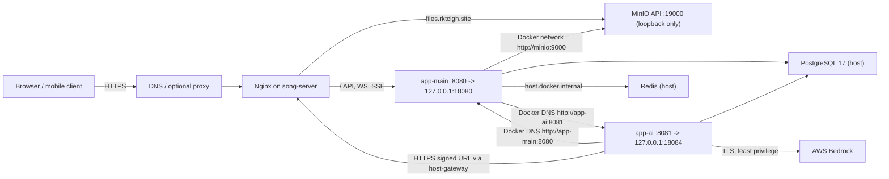

# Ieum AWS -> On-premises Migration: Executable Implementation Plan

> Status: **implementation and rehearsal plan only**. No production host, runtime, AWS resource, database, or GitHub secret is changed by this document. The `ieum1.rktclgh.site` DNS record was created outside this worktree and is only observed here; this plan never edits DNS.
>
> Working branch: `feat/onprem-minio-storage`  
> Isolated worktree: `/Users/songchiho/Desktop/Hackerthon/.worktrees/feat-onprem-minio-storage`  
> Baseline: `origin/main` at `52241c31`  
> Planned target host: `song-server` (the existing on-premises host; deployment uses a local runner and requires no inbound SSH path)

## 1. Goal and completion definition

Move Ieum's runtime from the current two-EC2 + RDS + AWS S3 layout to one on-premises Linux host while retaining only the AWS services that are intentionally still required by application behavior (currently Bedrock and any external OAuth/SMTP/API providers).

The finished system has:

1. one on-premises Compose project running `app-main` and `app-ai` on an internal Docker network;
2. PostgreSQL 17, Redis, and MinIO on the same host, with no public PostgreSQL or Redis listener;
3. MinIO reachable privately by the apps and through one public HTTPS file hostname for browser/app-ai presigned URLs;
4. root-owned runtime environment files on the server, never GitHub Actions secrets or repository files;
5. GitHub-hosted build/test/image publishing/signing plus a repository-scoped self-hosted runner on `song-server` for local plan/apply dispatch only;
6. a rehearsed restore, explicit public-write commit point, verified rollback boundary, and a 72-hour stabilization window before AWS retirement.

The migration is complete only after every item in [Section 12](#12-cutover-acceptance-matrix) passes on the new public origin and the production-write commit point has been recorded.

The final host state contains one Ieum application database named `ieum`. `ieum_rehearsal` is a disposable pre-cutover verification database only; it must be dropped after rehearsal evidence is captured and must not exist at the production-write commit point.

## 2. Decisions already fixed by evidence

| Decision | Chosen implementation | Why |
| --- | --- | --- |
| Application placement | One host, one Compose project, two services | App-main and app-ai already communicate privately; Docker service DNS removes AWS private-IP coupling. |
| PostgreSQL | Reuse the existing on-premises PostgreSQL 17 service and the single production `ieum` database; `ieum_rehearsal` is temporary only; do not add a PostgreSQL server, cluster, or production database | A PostgreSQL 18 source schema was restored into PostgreSQL 17 in rehearsal with required `postgis`, `pgcrypto`, `vector(768)`, indexes, and HNSW support. Full data restore remains a required gate. |
| Rehearsal database lifecycle | Create `ieum_rehearsal` only for an isolated restore/application rehearsal, then drop it before final cutover | The actual production database is always `ieum`; retaining rehearsal data on the operating host adds ambiguity and doubles sensitive data at rest. |
| Redis | Reuse the existing password-protected host Redis through `host.docker.internal`; bind only loopback plus Docker bridge; do not add a Redis service or container | The current app contract already uses host Redis. This branch adds the missing `REDIS_PASSWORD` mapping; existing sessions may be deliberately invalidated at cutover. |
| Object storage | Reuse the existing `vlainter-minio` container, `ieum-files` bucket, and `ieum-app-main` service account through a private API plus public HTTPS presign endpoint; do not add a MinIO or `mc` container | Browser and app-ai must resolve signed URLs; exposing loopback MinIO directly would fail. |
| Object URL form | Path-style MinIO requests | One `files.rktclgh.site` virtual host can safely serve `/<bucket>/<key>`; bucket-name DNS is not needed. |
| MinIO signing region | `us-east-1` unless MinIO is explicitly reconfigured before deployment | The live MinIO container has no configured region; an empty S3-specific region must not silently inherit `ap-northeast-2`. |
| CI runner | GitHub-hosted jobs build/test/push/sign; repository-scoped self-hosted runner `song-server-ieum-prod-01` runs only local plan/apply dispatch | The runner is dedicated to this repository and user, has no Docker/socket, runtime-env, checkout, or direct root-helper access, and reaches GitHub only over outbound HTTPS. |
| Runtime secrets | `/etc/ieum/app-main.env` and `/etc/ieum/app-ai.env`, mode 0600, server only | GitHub Actions needs deploy transport metadata, not application secrets. |
| Bedrock credentials | Reuse the existing server-held Bedrock credential for cutover; defer an Ieum-only least-privilege identity to post-cutover hardening | No new IAM identity, instance profile, container, or credential service is created for cutover; the existing credential is already validated for Bedrock. |
| Deployment gate | Public HTTPS health/API check is mandatory | The existing workflow treats a failed public check as a warning, which cannot prove a cutover succeeded. |
| Staging ingress | `ieum1.rktclgh.site` is a read-only, exact-host Nginx vhost used for pre-cutover validation | It isolates the new origin from `ieum.rktclgh.site`; no public write traffic is enabled by staging. |

## 3. Non-negotiable safety rules

1. Work only in the isolated worktree and branch above. Never implement this work directly in `develop`, `main`, or the original checkout.
2. Do not print, commit, upload, or place real passwords, access keys, JWT/HMAC values, VAPID private keys, OAuth secrets, or callback tokens in this plan, scripts, logs, artifacts, or GitHub.
3. Do not touch production DNS, running AWS services, the live RDS database, or the on-premises production database until a non-production restore rehearsal passes.
4. Keep the existing AWS runtime available and unchanged until the 72-hour post-cutover window has completed.
5. Treat the instant public write traffic is enabled on the on-premises origin as the **data-divergence commit point**. Before it, DNS rollback is safe. After it, DNS rollback is forbidden until new writes are reconciled back to RDS or intentionally discarded under an explicit incident decision.
6. Every deployment acquires one host-wide lock at `/var/lib/ieum/locks/deploy.lock`; GitHub Actions `concurrency` alone is repository-local and cannot protect a shared host. Do not use Ubuntu's world-writable `/var/lock` symlink target for this privileged lock.
7. Never publish `5432`, `6379`, `18080`, `18084`, `9000`, or `9001` to the Internet. Container ports `8080` and `8081` are reachable only behind their loopback host mappings. Only HTTPS/HTTP ingress is externally reachable; there is no inbound SSH, NAT, or port-forwarding deployment path.
8. Use immutable Docker image digests at deploy time. Mutable tags such as `latest` are not release identifiers.

## 4. Verified starting facts

- Current public application hostname: `ieum.rktclgh.site`.
- Staging application hostname: `ieum1.rktclgh.site`. Its Cloudflare DNS record is externally managed and currently resolves through Cloudflare; the origin has no Ieum vhost until the new app-main health gate passes.
- Intended public MinIO hostname: `files.rktclgh.site`.
- `files.rktclgh.site` is Cloudflare-proxied to the on-prem origin. Origin TLS, public TLS, and signed URL smoke remain hard pre-cutover gates.
- On-premises host is Ubuntu 24.04 with Docker, Nginx, PostgreSQL 17.10, and Redis active.
- Existing MinIO container is `vlainter-minio`, healthy on host loopback:
  - API: `127.0.0.1:19000 -> 9000`
  - Console: `127.0.0.1:19001 -> 9001`
- PostgreSQL source is RDS PostgreSQL 18.3. Its `ieum` database uses `pgcrypto`, `postgis`, and `vector`; schema compatibility has been exercised against PostgreSQL 17.
- The target currently exposes `5432` and `6379` on broad interfaces, Redis requires authentication, `127.0.0.1:8080` is already occupied by Vlainter, `127.0.0.1:18081` is occupied by `vlainter-app-green`, `18082` is occupied by FairPlay, and `127.0.0.1:18083` is occupied. `127.0.0.1:18080` and `127.0.0.1:18084` were checked available on 2026-08-06; Ieum uses those distinct loopback ports. Closing exposure and preserving these non-conflicting bindings are prerequisites, not cleanup.
- The current host has no Ieum app-main listener on `127.0.0.1:18080`; the local actuator check therefore fails until the signed release activates app-main. Non-interactive `sudo -n` is unavailable in the current non-root session, so root-owned helpers, environment files, the runner installer, dispatcher, and Nginx vhosts cannot be installed from this worktree. Do not install the `ieum1` vhost while 18080 is down: the result would be a 502/520 rather than a staging service.
- The host already has the Cloudflare wildcard origin certificate at `/etc/cloudflare/rktclgh.site.pem` and key at `/etc/cloudflare/rktclgh.site.key`. Its SAN covers `*.rktclgh.site`, including `ieum1.rktclgh.site`; the certificate is a prerequisite check, not permission to change Nginx without root access.
- App-main's current S3 presigned URLs are consumed directly by clients. App-ai downloads report images from an allowlisted hostname, so the public presign hostname must be exact.
- The existing full `:app-main:test` suite fails before the changed S3 tests run because Testcontainers 2.0.5 cannot extract its common test fixture under `/tmp`. The focused FileConfig tests and bootJar build pass. Repairing that CI harness is an independent mandatory work item; it is not evidence against the MinIO contract.

## 5. Target topology



The Compose network must be named `ieum`. Public ingress terminates at Nginx. PostgreSQL 17 and authenticated Redis remain the existing host services, and MinIO remains the existing `vlainter-minio` container, `ieum-files` bucket, and `ieum-app-main` service account. No new database, Redis, MinIO, or `mc` container is created. No direct app, database, Redis, or MinIO container port is public.

## 6. Repository changes and ownership map

All edits below belong only in this feature worktree.

| Path | Required change | Validation |
| --- | --- | --- |
| `app-main/src/main/java/shinhan/fibri/ieum/config/FileConfig.java` | Support separate private S3 API endpoint, public HTTPS presign endpoint, path-style access, and explicit S3 signing-region fallback. | `:app-main:test --tests ...FileConfigTest` |
| `app-main/src/test/java/shinhan/fibri/ieum/config/FileConfigTest.java` | Lock the MinIO/private-public endpoint contract and invalid endpoint rejection. | 9 focused tests pass. |
| `app-main/src/main/resources/application.properties` | Map optional `REDIS_PASSWORD` to Spring Boot Redis so the existing authenticated host Redis works. | Redis runtime-property contract test. |
| `app-main/src/test/java/shinhan/fibri/ieum/config/RedisRuntimePropertiesTest.java` | Prove configured password reaches `spring.data.redis.password` and absence stays blank for local development. | focused Gradle test. |
| `app-main/.env.example` | Declare the optional local Redis password. | local env contract review. |
| `deploy/env/app-main.env.example` | Replace AWS-only deployment guidance with the complete on-premises runtime contract. | Secret-free key diff against runtime validator. |
| `deploy/env/app-ai.env.example` | Replace EC2 private-IP guidance with service-DNS callback/image allowlist contract. | Secret-free key diff against runtime validator. |
| `deploy/onprem/compose.yml` | New unified Compose topology for app-main/app-ai. | `docker compose config`, local smoke deployment. |
| `deploy/onprem/nginx/ieum.rktclgh.site.conf` | New application proxy config. | `nginx -t`, private and public health checks. |
| `deploy/onprem/nginx/files.rktclgh.site.conf` | New MinIO HTTPS proxy preserving signed-request Host/path. | presigned PUT/GET/DELETE from a browser-like client. |
| `deploy/onprem/nginx/ieum1.rktclgh.site.conf` | Read-only exact-host staging proxy using the Cloudflare wildcard certificate and app-main loopback upstream. | installer contract, origin-local smoke, and `nginx -t`; never install before 18080 is healthy. |
| `deploy/onprem/scripts/validate-runtime-env.sh` | Fail closed on missing/unsafe non-secret runtime values. | Script unit/shell tests and negative fixtures. |
| `deploy/onprem/scripts/deploy-release.sh` | Source for the root-owned, signed-envelope, locked server deployment entrypoint. It is installed once as `/usr/local/sbin/ieum-deploy-release`; CI never runs a release-local script as root. | signed-envelope, stale-CAS, Nginx, health, and rollback shell tests. |
| `deploy/onprem/scripts/install-staging-nginx.sh` | Root-only, atomic installer for the `ieum1` vhost. It verifies app-main health and certificate SAN, rejects unsafe symlinks, runs `nginx -t`, reloads, and restores the previous config on failure. | installer shell test and origin-local `ieum1` smoke. |
| `deploy/onprem/scripts/db-preflight.sh` | Check PostgreSQL version/extensions/connectivity without mutating data. | passes against target rehearsal DB. |
| `deploy/onprem/scripts/db-restore-rehearsal.sh` | Installed root-owned as `/usr/local/sbin/ieum-db-restore-rehearsal`; restore/clean up only the temporary literal `ieum_rehearsal` database. It has no database-name argument and can never target `ieum`. | full RDS dump rehearsal followed by database absence check. |
| `deploy/onprem/scripts/db-restore-production.sh` | Installed root-owned as `/usr/local/sbin/ieum-db-restore-production`; restore only the literal production `ieum` database at the approved T-0 write fence. | final source dump restore and target verification. |
| `deploy/onprem/scripts/db-verify.sh` | Installed root-owned as `/usr/local/sbin/ieum-db-verify`; verify source/target PostgreSQL majors, dump checksum binding, extensions, schema objects, vector dimensions, index state, data totals, and the final Ieum database namespace. | source/target report comparison bound to one dump checksum. |
| `deploy/onprem/scripts/provision-existing-postgres.sh`, `provision-runtime-env.sh`, `validate-runtime-env.sh` | Installed root-owned as `/usr/local/sbin/ieum-provision-existing-postgres`, `/usr/local/sbin/ieum-provision-runtime-env`, and `/usr/local/sbin/ieum-validate-runtime-env`; create the restricted target role/libpq files and render/validate server-held runtime environment files. They are never exposed through `ieum-runner`'s dispatcher sudoers rule. | root-only provisioning rehearsal. |
| `deploy/onprem/scripts/object-store-mirror.sh` | Root-only one-time S3-to-MinIO migration helper, installed as `/usr/local/sbin/ieum-object-store-mirror`. It accepts only `dry-run`, `copy`, and `verify`; the copy path rejects a populated target unless explicitly acknowledged and never accepts `--remove` or `--watch`. | shell contract test plus source/target parity evidence. |
| `.github/workflows/release-onprem.yml` | The single production workflow: determine the full image pair, build only changed members, create/sign one release envelope, and invoke the restricted dispatcher. | workflow lint plus a fixture proving old production workflows cannot trigger. |
| `.github/workflows/deploy-app-main.yml`, `.github/workflows/deploy-app-ai.yml` | Retire before enabling `release-onprem.yml`; they must not remain independently triggerable production deployment paths. | repository search and workflow-fixture test. |
| `deploy/tests/*` | Replace hardcoded v24-v41 artifact lists and AWS-host assumptions with deterministic release-bundle checks. | targeted shell tests. |
| `docs/superpowers/plans/2026-08-06-ieum-onprem-migration-execution.md` | This execution plan. | review against Sections 11–13. |

## 7. Phase A — lock the implementation boundary

### A1. Preserve the primary checkout

Run only from the isolated worktree:

```sh
git -C /Users/songchiho/Desktop/Hackerthon/.worktrees/feat-onprem-minio-storage status --short
git -C /Users/songchiho/Desktop/Hackerthon/.worktrees/feat-onprem-minio-storage branch --show-current
git -C /Users/songchiho/Desktop/Hackerthon/code/ieum_be status --short
```

Required result:

- feature worktree reports `feat/onprem-minio-storage`;
- primary checkout has no Ieum migration edits;
- no command modifies `develop` or `main`.

### A2. Commit the already-isolated MinIO code only after review

The isolated diff must contain exactly these behavioral changes before broader deployment edits:

1. `AWS_S3_ENDPOINT`: endpoint that app-main can reach privately;
2. `AWS_S3_PRESIGN_ENDPOINT`: browser/app-ai reachable HTTPS origin;
3. `AWS_S3_PATH_STYLE_ACCESS_ENABLED=true` for MinIO;
4. `AWS_S3_REGION=us-east-1` for the currently region-unconfigured MinIO;
5. fail closed if the private endpoint is set without a public presign endpoint or explicit `AWS_S3_REGION`, if the public endpoint is HTTP, or if endpoint URI syntax is unsafe;
6. no endpoint override means native AWS S3 behavior stays unchanged.

Run before making more code changes:

```sh
./gradlew :app-main:test --tests shinhan.fibri.ieum.config.FileConfigTest --rerun-tasks
./gradlew :app-main:bootJar --rerun-tasks
git diff --check
```

Do not label the full test suite green until its Testcontainers extraction failure has a separate reproduction and fix.

## 8. Phase B — build the on-premises runtime contract

### B1. Create one Compose project

Create `deploy/onprem/compose.yml` with these exact structural rules:

```yaml
services:
  app-main:
    image: ${APP_MAIN_IMAGE_DIGEST}
    env_file:
      - /etc/ieum/app-main.env
    ports:
      - "127.0.0.1:18080:8080"
    extra_hosts:
      - "host.docker.internal:host-gateway"
    networks: [ieum, minio]
    restart: unless-stopped

  app-ai:
    image: ${APP_AI_IMAGE_DIGEST}
    env_file:
      - /etc/ieum/app-ai.env
    ports:
      - "127.0.0.1:18084:8081"
    extra_hosts:
      - "host.docker.internal:host-gateway"
    networks: [ieum]
    restart: unless-stopped

networks:
  ieum:
    external: true
    name: ieum
  minio:
    external: true
    name: ieum-minio
```

Implementation constraints:

- The compose file contains image references and non-secret structure only.
- `APP_MAIN_IMAGE_DIGEST` and `APP_AI_IMAGE_DIGEST` must match `*@sha256:*`; reject tag-only values.
- Remove per-EC2 bind-address variables from the new path. Existing legacy compose files remain until cutover is accepted.
- App-main talks to `http://app-ai:8081`; app-ai callbacks talk to `http://app-main:8080`. Both names are Docker DNS, not external DNS.
- Continue host PostgreSQL and Redis access through `host.docker.internal`, which resolves via `host-gateway`. App-main reaches MinIO on the persistent external Docker network under the `minio` alias. App-ai resolves `files.rktclgh.site` through the normal public DNS/Cloudflare edge and validates the public certificate; do not add a `host-gateway` override because the Cloudflare Origin CA certificate is not trusted as a direct app-ai TLS endpoint. The file DNS record must resolve before app-ai image download or signed URL gates can pass.

Validation:

```sh
docker compose --project-name ieum --env-file /srv/ieum/releases/<release-id>/release.env -f /srv/ieum/releases/<release-id>/deploy/onprem/compose.yml config --quiet
docker network inspect ieum
```

### B2. Make the server environment authoritative

Create server directories once, under an administrative account, before any live deploy:

```sh
sudo install -d -m 0750 -o root -g ieum /etc/ieum
sudo install -d -m 0700 -o root -g root /srv/ieum/staging
sudo install -d -m 0700 -o root -g root /srv/ieum/releases
sudo install -d -m 0750 -o root -g root /var/lib/ieum/backups
sudo install -d -m 0700 -o root -g root /var/lib/ieum/deployments
sudo install -d -m 0700 -o root -g root /var/lib/ieum/locks
sudo install -d -m 0700 -o root -g root /var/lib/ieum/maintenance
sudo install -d -m 0700 -o root -g root /var/lib/ieum/nginx-staging
sudo install -m 0600 -o root -g root /dev/null /etc/ieum/app-main.env
sudo install -m 0600 -o root -g root /dev/null /etc/ieum/app-ai.env
sudo install -m 0600 -o root -g root /dev/null /etc/ieum/postgres.pg_service.conf
sudo install -m 0600 -o root -g root /dev/null /etc/ieum/postgres.pgpass
sudo install -m 0600 -o root -g root /dev/null /etc/ieum/release-signing.allowed_signers
sudo install -m 0600 -o root -g root /dev/null /etc/ieum/docker-registry.env
```

Do **not** create `/srv/ieum/current` as a directory: the first accepted deployment creates it atomically as a symlink to `/srv/ieum/releases/<release-id>`. The root wrapper alone spools a signed CI bundle under `/srv/ieum/staging`; `ieum-runner` cannot write `staging`, `releases`, `current`, `/etc/ieum`, or deployment state.

Install the reviewed copies of `deploy-release.sh`, `db-preflight.sh`, `install-staging-nginx.sh`, `install-production-nginx.sh`, `object-store-mirror.sh`, and the local dispatcher once as root-owned `0755` files at `/usr/local/sbin/ieum-deploy-release`, `/usr/local/sbin/ieum-db-preflight`, `/usr/local/sbin/ieum-install-staging-nginx`, `/usr/local/sbin/ieum-install-production-nginx`, `/usr/local/sbin/ieum-object-store-mirror`, and `/usr/local/sbin/ieum-release-dispatch`. Rollback is a root-operator-only subcommand of `ieum-deploy-release`; there is no standalone `ieum-rollback-release` helper. These are the only privileged deployment entrypoints. A release bundle may contain migration SQL and Compose metadata, but no shell program inside the runner-writable staging tree is ever executed as root.

Populate the runtime and libpq files manually through a secret-safe terminal/editor; never construct them in a workflow log. The service/pass files are for the root-owned database preflight/restore tools only and must never be copied into an application container or GitHub Actions. Install the public half of the separate release-signing key as an `ieum-release` entry in `/etc/ieum/release-signing.allowed_signers`; its private half belongs only in the protected GitHub Environment and is never copied to the host.

Populate `/etc/ieum/docker-registry.env` from `deploy/onprem/docker-registry.env.example` through an administrative, secret-safe terminal. It must remain owned by `root:root`, mode `0600`, and contain exactly these two nonblank lines—no comments, blank lines, quotes, duplicate keys, or other keys—because the literal parser rejects any other form:

```dotenv
DOCKER_REGISTRY_USERNAME=<docker-hub-pull-username>
DOCKER_REGISTRY_PASSWORD=<docker-hub-pull-token>
```

These are Docker Hub pull-only credentials used by the root release helper for `docker login docker.io`; never install a GitHub Actions registry-write token or any credential with push/delete scope on the host. Do not print either value in commands, logs, or evidence.

`/etc/ieum/app-main.env` must include these concrete non-secret values:

```dotenv
SERVER_PORT=8080
SERVER_FORWARD_HEADERS_STRATEGY=native
SPRING_DATASOURCE_URL=jdbc:postgresql://host.docker.internal:5432/ieum
REDIS_HOST=host.docker.internal
REDIS_PORT=6379
REDIS_PASSWORD=<existing-host-redis-password>
CORS_ALLOWED_ORIGINS=https://ieum.rktclgh.site,https://ieum1.rktclgh.site
COOKIE_SECURE=true
WEB_PUSH_ENABLED=true
WEB_PUSH_VAPID_PUBLIC_KEY=<nonblank-server-generated-public-key>
WEB_PUSH_VAPID_PRIVATE_KEY=<nonblank-server-generated-private-key>
WEB_PUSH_VAPID_SUBJECT=<nonblank-mailto-or-https-subject>
APP_AI_REPORT_BASE_URL=http://app-ai:8081
APP_AI_REPORT_ALLOWED_HOSTS=app-ai
APP_AI_REPORT_ENABLED=true
APP_AI_QUESTION_ANSWER_DISPATCH_ENABLED=true
APP_AI_QUESTION_ANSWER_DISPATCH_BASE_URL=http://app-ai:8081
APP_AI_QUESTION_ANSWER_DISPATCH_ALLOWED_HOSTS=app-ai
APP_AI_ACCEPTED_ANSWER_DISPATCH_ENABLED=true
AWS_S3_BUCKET=ieum-files
AWS_S3_ENDPOINT=http://minio:9000
AWS_S3_PRESIGN_ENDPOINT=https://files.rktclgh.site
AWS_S3_PATH_STYLE_ACCESS_ENABLED=true
AWS_S3_REGION=us-east-1
AWS_S3_API_CALL_TIMEOUT_SECONDS=10
AWS_S3_API_CALL_ATTEMPT_TIMEOUT_SECONDS=3
```

It must additionally contain existing production values for database credentials, SMTP, JWT/HMAC values, OAuth keys, Naver/NCP/Google keys, the existing `ieum-app-main` MinIO service-account key and secret, the three nonblank VAPID values above, feature toggles, and one high-entropy `APP_AI_INTERNAL_CALLBACK_TOKEN`. Generate or retrieve these values through the approved secret manager; never copy the local `.env.deploy` wholesale because its RDS endpoint and old AWS S3 settings are not the on-premises contract.

`/etc/ieum/app-ai.env` must include these concrete non-secret values:

```dotenv
SERVER_PORT=8081
SPRING_DATASOURCE_URL=jdbc:postgresql://host.docker.internal:5432/ieum
AWS_REGION=ap-northeast-2
APP_AI_BEDROCK_REGION=ap-northeast-2
APP_AI_FEATURES_REPORT_REVIEW_ENABLED=true
APP_AI_FEATURES_QUESTION_ANSWER_ENABLED=true
APP_AI_FEATURES_ACCEPTED_ANSWER_INGESTION_ENABLED=true
APP_AI_GEMINI_API_KEY=<nonblank-server-secret>
APP_AI_REPORT_IMAGE_ALLOWED_HOSTS=files.rktclgh.site
APP_AI_QUESTION_CALLBACK_BASE_ORIGIN=http://app-main:8080
APP_AI_QUESTION_CALLBACK_ALLOWED_ORIGINS=http://app-main:8080
APP_AI_QUESTION_CALLBACK_CONNECT_TIMEOUT=2s
APP_AI_QUESTION_CALLBACK_READ_TIMEOUT=5s
```

It must additionally contain database credentials, the **same** callback token as app-main, a nonblank `APP_AI_GEMINI_API_KEY`, Gemini credentials/features, and the existing server-held Bedrock credential chain values required for cutover. The report-review, question-answer, and accepted-answer-ingestion feature flags above remain enabled for the cutover verification path. It must not contain app-main's MinIO endpoint, bucket, path-style, prefix, or MinIO credential material. Generic AWS credential-chain keys are permitted only for that existing Bedrock credential; do not create a new IAM identity, instance profile, container, or credential service for cutover. An Ieum-only least-privilege identity is post-cutover hardening. Do not copy a local `.env.deploy` wholesale: replace its RDS and legacy AWS S3 values with the on-premises PostgreSQL/MinIO endpoints before installation.

Implement `validate-runtime-env.sh` so it:

1. accepts a file path and service name;
2. reads keys without echoing values;
3. requires each listed non-secret key;
4. rejects RDS hostnames, `172.31.*` callback addresses, blank `AWS_S3_REGION` or `AWS_S3_PRESIGN_ENDPOINT` when `AWS_S3_ENDPOINT` is set, non-HTTPS public S3 endpoint, and an app-ai allowlist missing `files.rktclgh.site`;
5. verifies callback token exists in both files and compares it without printing either value;
6. verifies app-main/app-ai service URL and callback origin use Docker service names;
7. returns nonzero before Docker starts if any requirement fails.

### B3. Keep runtime state on the host and split CI from local dispatch

Remove use of `APP_MAIN_ENV_FILE` and `APP_AI_ENV_FILE` from every production workflow. GitHub-hosted jobs perform checkout, build, test, image push, and release signing. Only the repository-scoped self-hosted job performs `local-plan` and `local-apply`, and those steps invoke the narrow root-owned dispatcher; they never run a release-local shell script as root. The workflows may pass only:

- immutable image digests and non-secret release metadata;
- the dispatcher operation and its strict release ID/current-release/checksum arguments;
- GitHub Environment protection and explicit production approval.

The workflows must neither upload runtime env files nor print `env`, `docker inspect`, compose interpolation, or secret-bearing container logs. No `ONPREM_RELEASE_SSH_*` secret exists or is consumed. The runner does not read `/etc/ieum/*.env`, check out the repository, join the Docker group/socket, or call a root helper directly.

## 9. Phase C — close infrastructure prerequisites before rehearsal

### C1. PostgreSQL 17 preflight and hardening

First capture current listener and extension state without changing it:

```sh
sudo ss -lntp | egrep ":(5432|6379|18080|18084|19000|19001)\b"
sudo -u postgres psql -Atqc "show server_version; select extname || chr(58) || extversion from pg_extension order by extname;"
```

Install the PostgreSQL 17 extension packages required by the source schema before creating/restoring the database:

```sh
sudo apt-get update && sudo apt-get install -y postgresql-17-postgis-3 postgresql-17-pgvector
```

Do not blindly accept an extension-version change while installing packages. Capture the RDS extension versions first, then require the target report to match exactly; `ieum-db-verify` fails closed on a mismatch. PostgreSQL 17 has a `pgvector` package already on this host, but PostGIS is absent as of the 2026-08-07 audit.

Before binding an application database on the target, complete the C3 MinIO network attachment first, then run the root control-plane bootstrap. The bootstrap installs the release, database, runtime-environment, object-store mirror, and staging/production Nginx helpers, validates that `docker compose` is usable, and **reuses** the pre-existing `ieum` and `ieum-minio` networks. It fails closed if either network is missing or if the already-attached external `ieum-minio` network does not have exactly one running container owning the `minio` alias whose health endpoint is reachable through that alias. It never creates a Docker network or container.

The bootstrap deliberately rejects a user-writable checkout as its root source. First stage the reviewed snapshot under a root-owned, non-group/other-writable directory, then generate a manifest that includes every shell helper and the Python presign helper before invoking the bootstrap. Never run a DB/Nginx/root helper from `/home/song` or another writable worktree:

```sh
sudo bash -ceu '
cd /srv/ieum/bootstrap-source/<reviewed-release>
sha256sum deploy/onprem/scripts/*.sh deploy/onprem/scripts/minio-presign-smoke.py \
  | LC_ALL=C sort -k2 > .ieum-source.sha256
chmod 0644 .ieum-source.sha256
'
sudo IEUM_BOOTSTRAP_SOURCE_SNAPSHOT=/srv/ieum/bootstrap-source/<reviewed-release> IEUM_BOOTSTRAP_SOURCE_CHECKSUM=/srv/ieum/bootstrap-source/<reviewed-release>/.ieum-source.sha256 /srv/ieum/bootstrap-source/<reviewed-release>/deploy/onprem/scripts/bootstrap-control-plane.sh
docker network inspect ieum >/dev/null
docker network inspect ieum-minio >/dev/null
```

The bootstrap also installs the root-owned dispatcher, release helper, DB preflight/restore/verify/provision helpers, runtime-env helpers, object-store mirror, and both Nginx helpers plus their private state directories. For this architecture it supports only the `--install-runner-user` path; do not use or retain an `ieum-deploy`/authorized-keys bootstrap path. On the current host this command remains blocked until an administrative sudo session is available. After bootstrap, inspect the existing Docker subnets and discover the default Docker bridge gateway at execution time; do not copy a gateway address from another host. Generate the application credential as a root-only, exactly 64-hex-character value, then let the installed PostgreSQL provisioner create or update the role, database, extensions, and libpq files:

```sh
docker network inspect bridge --format "{{(index .IPAM.Config 0).Gateway}}"
sudo bash -ceu '
umask 077
file=/etc/ieum/postgres.app.env
tmp="$(mktemp "${file}.XXXXXX")"
trap '\''rm -f "$tmp"'\'' EXIT
password="$(openssl rand -hex 32)"
[[ "$password" =~ ^[0-9a-f]{64}$ ]]
printf '\''SPRING_DATASOURCE_USERNAME=ieum\nSPRING_DATASOURCE_PASSWORD=%s\n'\'' "$password" >"$tmp"
chown root:root "$tmp"
chmod 600 "$tmp"
mv -f "$tmp" "$file"
trap - EXIT
'
sudo /usr/local/sbin/ieum-provision-existing-postgres
```

The provisioner reads only the root-owned mode-0600 `/etc/ieum/postgres.app.env` file, validates the hexadecimal password, and owns creation or update of the restricted `ieum` role/database and required extensions. Do not manually create the role or database, apply ad hoc SQL for this role, or place the generated password in shell history.

Then:

1. add only `127.0.0.1` and the discovered default Docker bridge gateway to PostgreSQL `listen_addresses`;
2. add two narrow `pg_hba.conf` rows: one for `127.0.0.1/32`, one for `172.30.0.0/24`, both user `ieum`, database `ieum`, authentication `scram-sha-256`;
3. put the generated password only in both `/etc/ieum/app-*.env` files;
4. reload PostgreSQL;
5. prove an Internet host cannot establish TCP/5432 while a Compose service can connect.

Do not use `0.0.0.0` or public security-group-style openness as a convenience substitute.

### C2. Redis hardening and session decision

The default migration policy is intentional session invalidation. It avoids moving a 14-day Redis authentication/session state whose consistency cannot be proven after the final database dump.

The existing host Redis already requires a password. This branch maps `REDIS_PASSWORD` into Spring Boot's `spring.data.redis.password`; local development remains compatible because an unset value resolves blank. Put the existing host password in `/etc/ieum/app-main.env` only. Do not run the legacy `deploy/scripts/configure-host-redis.sh` on this shared host: its unauthenticated `redis-cli ping` checks and global configuration edits are incompatible with the live server.

Configure Redis to listen only on `127.0.0.1` and the default Docker bridge gateway discovered on this target, retain its existing authentication, and restart it only during the approved maintenance window. The Ieum Compose subnet is fixed at `172.30.0.0/24`; after hardening, test authenticated Redis access from the app-main container rather than relying on a host-only PING. Validate the host credential interactively without putting the password on the command line:

```sh
sudo ss -lntp | grep ":6379"
redis-cli --askpass ping
```

The expected response after the interactive password prompt is `PONG`. A dedicated Redis ACL username is intentionally deferred: current code now supports the existing password-protected default user; adding an ACL username requires a separate tested `REDIS_USERNAME` application contract. Never restore a whole shared Redis RDB/AOF from AWS, because it can overwrite Vlainter state.

A separate session-preservation branch is allowed only if all of these are true:

1. Redis version and persistence mode are recorded on source and target;
2. an RDB/AOF restore is rehearsed;
3. app-main login/refresh/logout tests pass after restore;
4. operators accept that session TTL state and in-flight refresh entries may behave differently.

Otherwise clear only the Ieum key namespace during cutover and announce mandatory re-login.

### C3. MinIO identity, bucket, CORS, and public proxy

The cutover reuses the existing MinIO owned by Vlainter's Compose file at `/home/song/Desktop/vlainter/deploy/local/docker-compose.infra.yml`, the named `vlainter-minio-data` volume, the `ieum-files` bucket, and the restricted `ieum-app-main` service account. Do not create a new MinIO container or replace this service for Ieum. The external Docker network `ieum-minio` has now been created and the existing `vlainter-minio` container is attached to it under the `minio` alias without a restart. This is a read-only topology change; it does not yet make the file hostname usable. If a future Vlainter maintenance window recreates the existing service, back up that volume, pin the image, and persist the second-network declaration in the Vlainter Compose file:

```yaml
image: minio/minio@sha256:14cea493d9a34af32f524e538b8346cf79f3321eff8e708c1e2960462bd8936e
```

Keep the attachment persistent in that **Vlainter-owned** Compose file; do not rely on a one-off `docker network connect`, because it disappears if MinIO is recreated:

```yaml
services:
  minio:
    networks:
      vlainter-net: {}
      ieum-minio:
        aliases: [minio]

networks:
  vlainter-net:
    name: vlainter-net
  ieum-minio:
    name: ieum-minio
```

The one-time network creation/attachment has already been performed without restarting MinIO. On the next planned Vlainter maintenance window, validate the persistent Compose declaration through its owning Compose project; do not create a second MinIO service or container for Ieum:

```sh
cd /home/song/Desktop/vlainter/deploy/local && docker compose -f docker-compose.infra.yml config --quiet
docker network inspect ieum-minio
docker exec vlainter-minio curl -fsS http://127.0.0.1:9000/minio/health/live
```

Reuse the existing `ieum-app-main` MinIO service account with access restricted to `ieum-files` and the prefixes used by app-main (`tmp/` and `final/`). Do not create another MinIO identity for cutover, and do not reuse root/admin credentials in app-main.

The host does not install `mc`; the already-running `vlainter-minio` container provides `/usr/bin/mc`. The `ieum-files` bucket and restricted `ieum-app-main` service account have already been created there and verified with an internal write/read/delete probe. Do not use `docker run`, pull an `mc` image, or create another MinIO container. Any recovery command must use `docker exec -i vlainter-minio` and pass a root-only configuration over stdin so credentials never enter shell history, command arguments, or logs.

Add the following least-privilege policy as `/etc/ieum/minio-ieum-main-policy.json` and verify it against the existing `ieum-app-main` MinIO user. Keep its existing secret only in `/etc/ieum/app-main.env`; do not create a replacement user for cutover:

```json
{
  "Version": "2012-10-17",
  "Statement": [
    {
      "Effect": "Allow",
      "Action": ["s3:GetObject", "s3:PutObject", "s3:DeleteObject", "s3:GetBucketLocation"],
      "Resource": [
        "arn:aws:s3:::ieum-files",
        "arn:aws:s3:::ieum-files/tmp/*",
        "arn:aws:s3:::ieum-files/final/*"
      ]
    }
  ]
}
```

The policy is verified or updated through the existing `vlainter-minio` `mc` client, and the existing `ieum-app-main` secret is stored only in root-owned `/etc/ieum/app-main.env`; it must never appear in shell argv, history, workflow output, or a Docker command line. The account must remain unable to list or access VlaInter's bucket.

Because the current server reports an unset region, keep `AWS_S3_REGION=us-east-1`. If an operator configures a different MinIO region, change the app-main value to that exact region and rerun the full signed URL smoke test before production. App-main's private endpoint is `http://minio:9000`, not the host's loopback port: the `ieum-minio` network is what makes this name resolve.

Create `deploy/onprem/nginx/files.rktclgh.site.conf` with these requirements:

```nginx
server {
    listen 443 ssl http2;
    server_name files.rktclgh.site;
    ssl_certificate /etc/cloudflare/rktclgh.site.pem;
    ssl_certificate_key /etc/cloudflare/rktclgh.site.key;
    client_max_body_size 16m;

    location / {
        proxy_pass http://127.0.0.1:19000;
        proxy_set_header Host $http_host;
        proxy_set_header X-Forwarded-Proto $scheme;
        proxy_set_header X-Forwarded-For $proxy_add_x_forwarded_for;
        proxy_request_buffering off;
        proxy_buffering off;
    }
}
```

The `Host $http_host` requirement is essential: SigV4 signs the public host. Do not rewrite the path, normalize query parameters, or proxy through an alternate bucket host.

The reused server runs the MinIO community build. Its S3 API returns
`NotImplemented` for per-bucket `PutBucketCors`, so do not make `mc cors set`
part of this cutover. The current shared MinIO API falls back to its global
`cors_allow_origin` setting; changing that global value during the Ieum cutover
could also affect the existing Vlainter tenant. Treat any future global-origin
hardening as a separate shared-infrastructure change with every tenant origin
inventoried and a MinIO restart window.

For this cutover, prove the effective behavior instead: both
`https://ieum1.rktclgh.site` and `https://ieum.rktclgh.site` must receive an
exact matching CORS allow-origin response for PUT and DELETE preflights, with
`content-type` allowed for PUT, and generated
presigned PUT, GET, HEAD, and DELETE requests must pass through
`https://files.rktclgh.site`. The HEAD request validates the signed public path
without an Origin header because the community build does not expose a
bucket-level method policy. A server-only unsigned `curl` success is
insufficient.

The root bootstrap installs `/usr/local/sbin/ieum-minio-presign-smoke`, and every local release apply runs it as a hard gate immediately after the production application and file Nginx vhosts are activated. It reads the root-only `/etc/ieum/app-main.env`, checks browser-like CORS preflights for both `https://ieum1.rktclgh.site` and `https://ieum.rktclgh.site`, then performs a secret-safe signed PUT/GET/HEAD/DELETE probe and confirms the fixture is no longer readable. A failed probe blocks activation; the helper emits operation-level errors only and removes its fixture on failure.

The MinIO console at 19001 remains loopback-only and must not receive a public Nginx server block.

### C4. Nginx application proxy and TLS

Create the production application vhost by preserving current API, WebSocket, SSE, request-size, and external Actuator-blocking behavior from `deploy/nginx/ieum.rktclgh.site.conf`, but change every application upstream from `http://127.0.0.1:8080` to `http://127.0.0.1:18080`. Both production and file vhosts use the existing Cloudflare Origin certificate paths `/etc/cloudflare/rktclgh.site.pem` and `/etc/cloudflare/rktclgh.site.key`; do not introduce nonexistent Let’s Encrypt paths. Do not bind Ieum to host port 8080 because Vlainter already owns it.

Create `deploy/onprem/nginx/ieum1.rktclgh.site.conf` as a separate exact-host staging vhost. It uses the existing Cloudflare wildcard origin certificate, proxies only to `127.0.0.1:18080`, keeps actuator/swagger/internal routes blocked, and accepts only `GET`, `HEAD`, and `OPTIONS`; all write methods return `405`. This is the pre-cutover public origin. It must not share a `map` declaration with the production vhost, and it must not be installed while app-main health is down.

When the signed release has started app-main and `curl http://127.0.0.1:18080/actuator/health` reports `UP`, the root-only `install-staging-nginx.sh` installer must:

1. verify the certificate SAN covers `ieum1.rktclgh.site` and reject unsafe certificate/key symlinks;
2. stage only the `ieum1` site file under `/var/lib/ieum/nginx-staging`;
3. run `nginx -t`, atomically install the site, and reload Nginx;
4. restore the previous `ieum1` file and reload again if validation or reload fails;
5. prove `https://ieum1.rktclgh.site/actuator/health` remains externally blocked and run the read-only API, WebSocket/SSE, and origin-local smoke checks.

Current host evidence is a hard blocker for this installation: `127.0.0.1:18080` is not listening and non-interactive `sudo -n` reports that a password is required. Do not bypass either condition or create an empty vhost. Once root bootstrap and app health are complete, verify the Cloudflare-proxied `ieum1` DNS record reaches this origin before considering the staging gate passed. During the pre-cutover read-only stage, production app-main CORS must allow exactly `https://ieum.rktclgh.site` and `https://ieum1.rktclgh.site` so browser API, WebSocket, and SSE verification uses the real origin. Remove `https://ieum1.rktclgh.site` only after the rollback/stabilization window closes, and update the runtime example and validator tests together.

Only after staging passes may the production vhost be installed and the DNS record for `ieum.rktclgh.site` moved. The file hostname must also point to the prepared ingress before application traffic moves. If a proxy/CDN is used, verify it does not strip signed-query parameters or modify the `Host` behavior above.

### C5. Bedrock credential and model gate

Use the existing server-held AWS credential already validated for Bedrock; do not create a new IAM identity, instance profile, container, or credential service for this cutover. Stage only that credential's required values in the root-owned app-ai runtime overlay, and do not expose or modify the existing service that currently holds it. A separate Ieum-only least-privilege identity remains a post-cutover hardening task, not a prerequisite for this migration.

Before writing a policy, read actual inference-profile availability with an authorized administrator credential:

```sh
aws bedrock get-inference-profile --region ap-northeast-2 --inference-profile-identifier apac.amazon.nova-micro-v1:0
aws bedrock get-inference-profile --region ap-northeast-2 --inference-profile-identifier apac.amazon.nova-lite-v1:0
```

If either command fails, stop this phase and select a verified regional/profile pair before granting application access. Do not broaden to `AmazonBedrockFullAccess`.

For non-streaming code currently using Spring AI `chatModel.call(...)`, verify that the reused credential has `bedrock:InvokeModel` only on the verified inference-profile/foundation-model resources required by the chosen pair. Add `bedrock:InvokeModelWithResponseStream` only if a later code change introduces `chatModel.stream(...)`.

Place the reused credential only in `/etc/ieum/app-ai.env`, mode 0600. Leave `APP_AI_BEDROCK_PROFILE` empty unless intentionally using a named local profile. Long-term, move to an Ieum-only least-privilege identity (with IAM Roles Anywhere if appropriate) as post-cutover hardening; it is not a cutover prerequisite.

## 10. Phase D — data migration and application rehearsal

### D1. Rehearsal inputs and inventory

Record, without exposing secrets:

```sh
psql "host=core-db.clakmui6mudt.ap-northeast-2.rds.amazonaws.com port=5432 dbname=ieum user=<readonly-or-dump-role>" -Atqc "show server_version"
psql "host=core-db.clakmui6mudt.ap-northeast-2.rds.amazonaws.com port=5432 dbname=ieum user=<readonly-or-dump-role>" -Atqc "select extname || chr(58) || extversion from pg_extension order by extname"
```

Create an inventory report containing:

- database byte size;
- table row counts for all user tables;
- maximum `created_at` and `updated_at` where those columns exist;
- migration helper version and its post-schema-contract result (this repository does not have a Flyway/Liquibase migration ledger);
- extension versions;
- index count and invalid-index count;
- object count/bytes in `ieum-files`;
- Redis version, persistence setting, and key count.

Store reports under `/var/lib/ieum/backups/rehearsals/<timestamp>/` with root-only permissions. Do not place them in the repository.

Exact source/target count parity is valid only when the source report describes the same snapshot as the dump. For rehearsal, establish a short, explicit AWS write fence first, create the custom dump, calculate its SHA-256, and capture the source report with that exact `--dump-sha256` before releasing the fence. Run that source capture on the RDS-reachable administrative machine using its separate root-only `ieum_rds` service/pass files; the on-prem PostgreSQL provisioner intentionally creates only local `ieum_target*` services. Transfer the completed source report with the dump evidence. The target capture must carry the same checksum; `ieum-db-verify compare` rejects an omitted or different checksum. Do not compare a live source report taken after a still-live source database has advanced. The final T-0 fence below already satisfies this requirement.

### D1a. S3 -> MinIO object restore rehearsal

Create `/etc/ieum/object-store-mirror.env` from `deploy/onprem/object-store-mirror.env.example`, replace every angle-bracket value, then set owner `root:root` and mode `0600`. It is a migration-only file, never loaded by app-main/app-ai, and should be removed after the stabilization window. The AWS source bucket is `ieum-prod-files`; the existing MinIO target bucket remains `ieum-files`. Reuse the already-created `ieum-app-main` MinIO service-account credentials for the target; do not create a separate MinIO migration identity. The AWS migration role needs only list/get access to source bucket `ieum-prod-files`. Do not use an AWS administrator credential.

The root-owned helper uses `/usr/bin/mc` inside the existing `vlainter-minio` container. It sends a per-command temporary configuration over stdin, removes it after each command, and never starts an image or container. It creates ephemeral `source` (AWS S3 Seoul endpoint) and `target` (`http://minio:9000`) aliases. Run the rehearsal in this order:

```sh
sudo /usr/local/sbin/ieum-object-store-mirror dry-run
sudo /usr/local/sbin/ieum-object-store-mirror copy
sudo /usr/local/sbin/ieum-object-store-mirror verify
```

`dry-run` executes the real `mc mirror --dry-run --overwrite --retry --summary` operation without creating a target bucket. `copy` requires the pre-existing `ieum-files` target bucket and fails closed if it is missing; it never creates a bucket. It refuses a populated target unless the operator explicitly supplies `--allow-existing-target`. The final delta during the write fence therefore uses `copy --allow-existing-target`, followed by `verify`.

`verify` preserves root-only `source.ls.json`, `target.ls.json`, `source.du.json`, `target.du.json`, and `sample-sha256.json` under `/var/lib/ieum/object-store-mirror/`. It requires exact object key/size and total count/byte parity, then compares content type and SHA-256 content for up to ten deterministic samples that prefer distinct top-level prefixes. It rejects `--remove` and `--watch`, leaving the source unchanged.

MinIO documents that `mc mirror` copies only current objects and does not carry version history or metadata other than tags. If Ieum depends on object versions or additional metadata, stop and use a replication/export design instead; the helper's content-type verifier is an explicit gate against an unsafe silent cutover.

Run the full copy and verification in rehearsal while AWS is still live. The final delta mirror happens only during the cutover write freeze described in Section 13.

### D2. Full RDS -> PostgreSQL 17 restore rehearsal

This is a PostgreSQL 18-to-17 **downgrade**, not an automatic supported upgrade path. PostgreSQL does not guarantee that a PG18 dump loads into PG17, even when PostgreSQL 18 client tools can read the archive. On the RDS-reachable administrative machine and on the target host, provide only the PostgreSQL 18 client package (`postgresql-client-18`) so `/usr/lib/postgresql/18/bin/pg_dump` and `/usr/lib/postgresql/18/bin/pg_restore` exist. This does not create or launch a second PostgreSQL server. The existing PostgreSQL 17 service remains the sole target database and supplies its pinned `/usr/lib/postgresql/17/bin/pg_dump`/`pg_restore` only for target backup and rollback. `pg_dump` 17 must not be used against RDS 18, and the PostgreSQL 18 restore client is required to read the source archive; the zero-error rehearsal below is the acceptance gate for whether this application's actual SQL and extensions are compatible with PostgreSQL 17.

On the RDS-reachable administrative machine, create root-only `/etc/ieum/rds-dump.pg_service.conf` and matching mode-0600 `/etc/ieum/rds-dump.pgpass` once. The service file contains the known RDS host, port, database, and dump role; the password file contains the corresponding credential. Do not use `PGPASSWORD` in a command or shell history.

Produce one custom-format dump. Do not use schema-only output for this gate:

```sh
PGSERVICE=ieum_rds \
PGSERVICEFILE=/etc/ieum/rds-dump.pg_service.conf \
PGPASSFILE=/etc/ieum/rds-dump.pgpass \
/usr/lib/postgresql/18/bin/pg_dump \
  --format=custom \
  --no-owner \
  --no-acl \
  --file=/secure/path/ieum-rehearsal.dump \
  ieum
```

Transfer it through an encrypted administrative channel, then use the rehearsal-only helper. Its name is intentionally not parameterized: it can only create/drop `ieum_rehearsal`, and never `ieum`.

```sh
PGSERVICEFILE=/etc/ieum/postgres.pg_service.conf \
PGPASSFILE=/etc/ieum/postgres.pgpass \
  /usr/local/sbin/ieum-db-restore-rehearsal restore \
  --admin-service ieum_target_admin \
  --dump /secure/path/ieum-rehearsal.dump \
  --sha256 <verified-64-lowercase-hex-checksum> \
  --evidence-dir /var/lib/ieum/backups/rehearsals/<timestamp>
```

The helper verifies a root-only mode-0600 dump and checksum through a private immutable snapshot, requires `/usr/lib/postgresql/18/bin/pg_restore` to report major version 18 before any restore, creates only `ieum_rehearsal` from `template0` owned by `ieum`, adds required extensions as administrator, and filters only exact pgcrypto/PostGIS/vector `EXTENSION` and `COMMENT - EXTENSION` TOC entries. It runs the PostgreSQL 18 client with `--single-transaction --exit-on-error --no-owner --no-acl --role=ieum` against the existing PostgreSQL 17 target; an error attempts cleanup and leaves an explicit failure signal. It must not use a broad filter that silently removes application objects.

After calculating `dump_sha256` from that immutable dump, capture and compare the reports through the installed root-owned helper. The source must report PostgreSQL 18 and literal database `ieum`; the rehearsal target must report PostgreSQL 17 and literal database `ieum_rehearsal`; both reports must contain the same checksum:

```sh
# RDS-reachable administrative machine, while the source write fence remains active
PGSERVICEFILE=/etc/ieum/rds-dump.pg_service.conf \
PGPASSFILE=/etc/ieum/rds-dump.pgpass \
/usr/local/sbin/ieum-db-verify capture \
  --kind source --service ieum_rds --dump-sha256 "$dump_sha256" \
  --output /secure/path/source.report

# Target host, after the rehearsal restore
sudo PGSERVICEFILE=/etc/ieum/postgres.pg_service.conf \
PGPASSFILE=/etc/ieum/postgres.pgpass \
/usr/local/sbin/ieum-db-verify capture \
  --kind rehearsal-target --service ieum_target_rehearsal --dump-sha256 "$dump_sha256" \
  --output /var/lib/ieum/backups/rehearsals/<timestamp>/target.report
sudo /usr/local/sbin/ieum-db-verify compare \
  --source /secure/path/source.report \
  --target /var/lib/ieum/backups/rehearsals/<timestamp>/target.report
```

Run `ieum-db-verify` against source and target. It must compare at least:

```sql
select extname, extversion from pg_extension order by extname;
select count(*) from pg_class where relkind = 'r' and relnamespace = 'public'::regnamespace;
select count(*) from pg_indexes where schemaname = 'public';
select count(*) from pg_index where not indisvalid;
select count(*) from pg_tables where schemaname = 'public' and tableowner <> 'ieum';
select c.relname, a.attname, a.atttypmod
from pg_attribute a
join pg_class c on c.oid = a.attrelid
join pg_namespace n on n.oid = c.relnamespace
where n.nspname = 'public'
  and (c.relname, a.attname) in (('ai_question_tasks', 'embedding'), ('knowledge_chunks', 'embedding'))
order by c.relname, a.attname;
```

The verifier must also run table-level counts for all user tables and report exact mismatches. It exits nonzero if any extension is absent, invalid index exists, required vector dimension is not 768, application ownership is wrong, or any count differs. It must not claim to inspect a migration ledger that this application does not have.

A successful restore rehearsal validates this exact PostgreSQL 18-to-17 archive and target package combination; it does not make the downgrade generally supported or authorize a live cutover until the application rehearsal below also succeeds. `ieum_rehearsal` remains temporary until that application rehearsal evidence is captured.

### D3. Package and test migrations deterministically

The current GitHub workflows hardcode migration file copying for versions v24–v41. Replace this with one deterministic release bundle:

1. release bundle includes `deploy/scripts/apply-admin-dashboard-migrations.sh` and the exact migration files it invokes;
2. migration ordering stays in one manifest inside the script, not shell glob order;
3. script maintains the existing advisory lock, precondition checks, and postcondition schema checks;
4. deployment runs migrations once against target `ieum` before the new app-main accepts public traffic;
5. rerunning the script against the same schema must exit successfully without applying an incompatible change;
6. tests derive expected artifact names/order from the same manifest or validate it directly so workflow and helper cannot drift.

Run existing deployment migration tests plus a PostgreSQL 17 integration execution against the temporary `ieum_rehearsal` database only.

### D4. Deploy the rehearsal stack without public production traffic

Every CI bundle is a deterministic signed archive streamed to a fixed root-owned wrapper. A release ID is **not** just the Git SHA; its only accepted format is:

```text
r-<github-run-id>-<positive-run-attempt>-<40-lowercase-hex-backend-sha>
```

```text
/srv/ieum/staging/<release-id>/                  # root-only temporary archive spool
/srv/ieum/releases/<release-id>/                 # root:root, immutable after promotion
  release.env
  manifest.json
  checksums.sha256
  deploy/onprem/compose.yml
  deploy/onprem/nginx/
  deploy/onprem/scripts/validate-runtime-env.sh
  deploy/onprem/scripts/install-staging-nginx.sh
  deploy/scripts/apply-admin-dashboard-migrations.sh
  db/migrations/<the exact referenced SQL files>

/srv/ieum/current -> /srv/ieum/releases/<successful-release-id>
/var/lib/ieum/deployments/<release-id>/state.env # root-only, immutable release metadata
/var/lib/ieum/deployments/<release-id>/activation.env # root-only activation journal
```

`release.env` is strict-parsed, never sourced, and contains exactly two pinned digest values:

```dotenv
APP_MAIN_IMAGE_DIGEST=docker.io/songchih/ieum-app-main@sha256:<64-lowercase-hex-digest>
APP_AI_IMAGE_DIGEST=docker.io/songchih/ieum-app-ai@sha256:<64-lowercase-hex-digest>
```

`manifest.json` includes schema version, release ID, backend/frontend source SHAs, GitHub run ID/attempt, exact image pair, rebuild flags, and `previous_release` as either `null` or `{ "release_id": "...", "bundle_sha256": "..." }`. It never embeds its own checksum. `checksums.sha256` is sorted and covers every inner payload member except itself, including `manifest.json`; that avoids a circular manifest-checksum definition.

The workflow creates a deterministic **inner** `release.tar` (sorted paths, numeric root owner/group, fixed modes, no runner timestamp) and calculates its exact SHA-256. It signs those bytes with SSHSIG namespace `ieum-release` using `RELEASE_SIGNING_PRIVATE_KEY`, producing detached `release.tar.sig`. The streamed **outer** `release-envelope.tar` contains exactly regular files `release.tar` and `release.tar.sig`, no links or other entries. The dispatcher passes the expected inner `--bundle-sha256` and that outer archive on stdin. Root spools at most 256 MiB, rejects absolute paths, `..`, links, devices, duplicate/unexpected members, bad modes, a mismatched inner checksum, or a bad SSHSIG before extracting the inner tar. It verifies the signature with `ssh-keygen -Y verify -n ieum-release -I ieum-release -f /etc/ieum/release-signing.allowed_signers -s release.tar.sig < release.tar`. The allowed-signers file is root-owned and can contain the current plus a staged rotated signing key; remove a revoked key before accepting future releases. Root then rejects an invalid inner layout, per-file checksum mismatch, or a non-allowlisted image repository. The release layout preserves `deploy/scripts` and `db/migrations` paths so the migration helper cannot accidentally resolve SQL from the caller's working directory.

The fixed root-owned control plane has one narrow local dispatcher for the runner and one root-operator rollback path:

```sh
sudo -n /usr/local/sbin/ieum-release-dispatch --local current --json
sudo -n /usr/local/sbin/ieum-release-dispatch --local apply \
  --release-id <release-id> \
  --expected-current <release-id-or-none> \
  --bundle-sha256 <64-lowercase-hex> < release-envelope.tar

/usr/local/sbin/ieum-deploy-release rollback \
  --expected-current <release-id> \
```

The `ieum-runner` local dispatcher exposes only `--local current --json` and the bounded streamed `--local apply` operation. `current --json` returns release ID, bundle SHA-256, source SHAs, migration digest, and both deployed image digests—never runtime environment values. `apply` accepts no caller-selected filesystem path, Compose file, digest, URL, or environment-file argument. Under the host-wide lock it compare-and-swaps the expected current release with the root-owned state; a stale bundle fails rather than replacing a newer pair. The `rollback` command is root-operator-only and is never available through the runner dispatcher; it remains refused after the public-write commit marker exists.

The fixed wrapper implements this sequence:

1. require `set -euo pipefail`, bound/spool stdin, validate the release ID, verify the fixed two-file outer envelope and SSHSIG, validate inner checksums/layout, take `flock -n /var/lib/ieum/locks/deploy.lock`, and perform the previous-release compare-and-swap;
2. promote only the verified archive into a root-owned immutable release;
3. verify `/etc/ieum/app-main.env` and `/etc/ieum/app-ai.env` are exact root-owned, mode-0600 regular files, then run the runtime validator in both directions;
4. record the previous release/image/service state in root-only `state.env`, pull both immutable digests using only server-owned Docker credentials, and verify the rendered Compose images exactly match those two digests;
5. compare the new migration digest with root-owned current state. If it differs, require the root-owned active write fence before stopping services or running a migration; if it is equal, skip the migration helper entirely;
6. use exactly `docker compose --project-name ieum --env-file <release>/release.env --file <release>/deploy/onprem/compose.yml` for every Compose operation; run the migration helper once, then app-ai (`127.0.0.1:18084`) before app-main (`127.0.0.1:18080`);
7. write activation phases (`INSTALLED`, `MIGRATION_STARTED`, `MIGRATION_SUCCEEDED`, `SERVICES_HEALTHY`, `NGINX_STAGED`, `COMMIT_PENDING`, `ACTIVE`) to the root-only journal. If migration has started and any later step fails, record `MANUAL_INTERVENTION` and leave the write fence enabled; do not silently roll back over an uncertain schema;
8. stage the three release Nginx files under a root-only candidate directory, run `nginx -t` against the candidate, atomically replace the production, file, and `ieum1` site files, reload Nginx, and restore the previous site files if validation or reload fails. The `ieum1` installer separately enforces read-only methods and its app health/certificate gates;
9. verify health, container image IDs, Docker-DNS callbacks, and origin-local `ieum1` HTTPS/API checks without printing container environments, health bodies, or secret-bearing logs;
10. atomically change `/srv/ieum/current` only after all pre-public-write checks pass; write a concise pass/fail log containing only release ID, SHA, digests, migration digest, activation phase, and timestamps.

The rehearsal uses a separate, root-operated environment overlay connected only to literal `ieum_rehearsal`, a temporary project/host name, and a write-blocked ingress. It never reuses the final `/etc/ieum/app-main.env`, `/etc/ieum/app-ai.env`, `/srv/ieum/current`, or production Compose project. It proves the same release bundle and migration order before the production wrapper is used.

The write fence is a root-owned, non-symlink mode-0600 `/var/lib/ieum/maintenance/write-fence` whose sole content is `IEUM_PRODUCTION_WRITE_FENCE=enabled`. A root operator creates it only after public maintenance, source-write fencing, and target service stop evidence are recorded. The root wrapper and production DB helper reject missing, malformed, symlinked, or non-private fences. The operator removes it only after an explicit acceptance/rollback decision. This is deliberately manual for migration-changing releases; application-only releases with an unchanged migration digest do not consume it.

Automatic rollback is deliberately limited. A failure **before** migration begins may restore the prior image/service/Nginx state. After migration begins, the wrapper must keep maintenance enabled and refuse automatic image rollback unless a machine-readable no-op receipt proves no schema/data mutation occurred. It never rolls back PostgreSQL or MinIO. At the public-write commit point, root creates `/var/lib/ieum/state/public-write-committed`; the root-operator `ieum-deploy-release rollback` subcommand hard-refuses after that marker exists, and the runner dispatcher never exposes rollback.

After the release/rollback rehearsal report, database parity report, and application smoke evidence are retained outside the database, stop the rehearsal containers and remove the temporary database. Do not begin T-0 while it exists:

```sh
sudo -u postgres psql -d postgres -v ON_ERROR_STOP=1 -c "select pg_terminate_backend(pid) from pg_stat_activity where datname = 'ieum_rehearsal' and pid <> pg_backend_pid()"
sudo -u postgres dropdb --if-exists ieum_rehearsal
test -z "$(sudo -u postgres psql -Atqc "select 1 from pg_database where datname = 'ieum_rehearsal'")"
```

### D5. Repair the unrelated full-test CI failure

Reproduce the existing failure independently before changing production tests:

```sh
./gradlew :app-main:test --rerun-tasks --stacktrace
find /tmp -maxdepth 2 -type d -name '.testcontainers-tmp*' -print
```

The observed failure is Testcontainers 2.0.5 fixture extraction reporting `FileSystemException ... Not a directory`. Determine whether it is a stale path, a runner filesystem issue, or a version incompatibility. Add a minimal regression test or CI setup assertion before changing dependency versions or test configuration.

Do not delete smoke tests merely to make CI green. Keep only tests that protect runtime contracts: focused application config tests, migration ordering/execution tests, compose/env validation, and the public deploy gate. Remove a test only after identifying its covered behavior and replacing it with a cheaper, equally effective check.

## 11. Phase E — GitHub Actions deployment redesign

### E1. Use one release-owning GitHub-hosted workflow plus a same-host local dispatcher job

Replace the two independent production deploy workflows with one `release-onprem.yml`. GitHub-hosted jobs run on `ubuntu-latest` and own checkout, build, test, image push, release assembly, and signing. A separate repository-scoped self-hosted job on `song-server` owns only the local plan/apply dispatcher calls. The workflow keeps this literal concurrency block:

```yaml
concurrency:
  group: ieum-onprem-production
  cancel-in-progress: false
```

It triggers on backend push paths covering both applications, `common/**`, root build/toolchain files, Dockerfiles, `db/migrations/**`, and `deploy/onprem/**`; on the existing exact-frontend-SHA `repository_dispatch`; and on manual `rebuild=auto|app-main|app-ai|both|redeploy` dispatch. Do **not** keep two thin application deploy callers: a `common/**` change currently triggers both old workflows and would create two partial shared-Compose releases.

Build the frontend in a separate untrusted job that runs without the `ieum-production` Environment, release signing key, Docker registry write token, or server environment files. That job uploads only the static build artifact and the exact source SHA. The protected release job downloads the artifact, verifies that SHA against the requested commit, and then incorporates the files into the app-main image; the artifact never carries `.env.deploy` or server runtime values. This keeps frontend build code outside the privileged release boundary while retaining one signed backend/frontend release manifest.

The workflow's self-hosted `local-plan` step calls the narrow dispatcher `current --json` before planning. It diffs the current release's backend SHA to the target SHA, not only the push event's predecessor, so queued work is cumulative. Rebuild mapping is fixed:

| Change | Rebuild |
| --- | --- |
| `app-main/**`, its Dockerfile, or frontend SHA | app-main |
| `app-ai/**` or its Dockerfile | app-ai |
| `common/**`, root Gradle/toolchain, `.dockerignore` | both |
| migrations, Compose, Nginx, release metadata only | neither; redeploy the current pair with the new signed bundle |
| no current release | both required |

After each required image push, the workflow uses the registry-produced immutable digest. For an unchanged service it uses the digest from the root-owned `current --json` record—never `latest`, a source tag, or another workflow's success. A first deployment with only one image fails. The frontend remains an app-main build input and is never a server runtime service; frontend `.env.deploy` stays out of the host.

The self-hosted job is not a generic shared runner. Do not substitute the existing FairPlay/Vlainter `song` runners: they are repository-scoped to other repositories and their account has Docker and sudo access. Do not add inbound SSH, NAT, or port forwarding. The self-hosted job requires outbound HTTPS from `song-server` to GitHub; no `ONPREM_RELEASE_SSH_*` secret, SSH host-key pin, SSH private key, or deployment account/key is configured.

### E2. Install the repository-scoped same-host runner and narrow local dispatcher

On `song-server`, complete this setup once as root during the administrative window:

1. create Unix user `ieum-runner` with a locked password and no interactive login, the `/bin/bash` service shell required by the runner, no Docker group/socket membership, no read access to `/etc/ieum/*.env`, release directories, deployment state, database credentials, or MinIO credentials, and no repository checkout on the host;
2. use the reviewed root-only runner installer with the repository scope, runner name `song-server-ieum-prod-01`, and exact labels `self-hosted,linux,x64,ieum-prod-deploy`. Obtain the GitHub personal-account repository registration token just before installation; it is temporary, single-use setup input. Store it only in a root-owned mode-0600 token file; never put it in shell history, a runner directory, workflow output, or logs, and do not print it. GitHub's upstream unattended client accepts this temporary registration token only through its short-lived child-process `--token` argument, so perform registration in a controlled maintenance window on a host whose untrusted users cannot inspect other processes. From the root-owned staged source, the walkthrough is:

   ```sh
   sudo /srv/ieum/bootstrap-source/<reviewed-release>/deploy/onprem/scripts/bootstrap-control-plane.sh --install-runner-user
   sudo install -m 0600 -o root -g root /dev/null /var/lib/ieum-runner/registration.token
   sudo /srv/ieum/bootstrap-source/<reviewed-release>/deploy/onprem/scripts/install-self-hosted-runner.sh --token-file /var/lib/ieum-runner/registration.token
   ```

   Populate the token file through a root-only secret-safe terminal before the installer runs; the installer removes it after successful registration. The token is never stored in the runner directory or GitHub workflow.
3. install the runner service as `ieum-runner` under a root-owned directory, enable it only after validating outbound GitHub HTTPS, and verify the runner reports online with those exact labels. A personal-account repository runner is not a generic multi-repository runner; sharing it would require organization scope and a separate security design;
4. install the root-owned narrow dispatcher and grant `ieum-runner` only the exact `sudo` allowance for `/usr/local/sbin/ieum-release-dispatch --local`. The dispatcher accepts only `--local current --json` and the bounded streamed `--local apply --release-id <id> --expected-current <id-or-none> --bundle-sha256 <digest>` operation. It rejects arbitrary commands, paths, images, Compose files, URLs, environment-file arguments, shell expansion, and every other root helper. Rollback is a root-operator-only local command and is never exposed to the runner;
5. keep `/etc/ieum/app-main.env` and `/etc/ieum/app-ai.env` root-owned mode `0600`; the runner cannot read, upload, interpolate, or print them. The dispatcher owns the host-wide lock and compare-and-swap state, then invokes the fixed root deployment helper internally;
6. configure `release-onprem.yml` so GitHub-hosted jobs finish build/test/push/sign first, then `local-plan` and `local-apply` run on `runs-on: [self-hosted, linux, x64, ieum-prod-deploy]`. Those steps invoke only the narrow dispatcher. They must not run `docker`, check out repository files, execute release scripts, inspect container environments, or call direct root helpers.

The runner's outbound-only control path therefore cannot be reached by another repository or an inbound network client. Existing PostgreSQL, Redis, MinIO, no-new-database/no-new-container rules, and the root-owned release lock remain unchanged.

### E3. Make the staging and public checks hard gates

After internal health checks, the release must first verify the read-only staging origin. The check must use the exact hostname, require the staging `GET` response's `X-Ieum-Release-ID` header to equal the release ID reported by the root `current --json` state, and reject any write method:

```sh
expected_release_id=$(sudo -n /usr/local/sbin/ieum-release-dispatch --local current --json | sed -n 's/.*"release_id":"\([^"]*\)".*/\1/p')
actual_release_id=$(curl --cacert /etc/cloudflare/rktclgh.site.pem --fail --silent --show-error --max-time 15 \
  --resolve ieum1.rktclgh.site:443:127.0.0.1 -D - -o /dev/null \
  https://ieum1.rktclgh.site/api/places/search | awk 'tolower($1) == "x-ieum-release-id:" { sub(/[[:space:]]+/, "", $2); print $2 }')
test "$actual_release_id" = "$expected_release_id"
curl --cacert /etc/cloudflare/rktclgh.site.pem --silent --show-error --max-time 15 --resolve ieum1.rktclgh.site:443:127.0.0.1 \
  -X POST -o /dev/null -w '%{http_code}\n' https://ieum1.rktclgh.site/api/places/search
```

The first request must return the expected unauthenticated place-search response and the exact release-ID equality check above; the second must return `405`. Origin-local smoke must trust the installed Cloudflare Origin CA certificate via `--cacert /etc/cloudflare/rktclgh.site.pem` (or an equivalent trusted CA bundle); never weaken verification with `-k`/`--insecure`. From a browser context whose page origin is `https://ieum1.rktclgh.site`, also run the authenticated test-user API flow, one WebSocket upgrade/message exchange, and one SSE connection/heartbeat. These browser checks are required because a server-side `curl` does not exercise CORS or the browser Origin header. Then, after the production vhost is installed but before the `ieum.rktclgh.site` public-write commit point, verify the known public-safe place endpoint:

```sh
curl --fail --silent --show-error --max-time 15 https://ieum.rktclgh.site/api/places/search
```

The expected app response is HTTP 200 with the empty place-search payload; that endpoint is unauthenticated and returns without calling an external maps provider when no query is supplied. Do not use the externally blocked Actuator endpoint as the public success check. The MinIO public gate is the signed PUT/GET/HEAD/DELETE smoke test from Phase C3, not a bucket-root response code.

Failure at either staging or production is a deploy failure, not a warning. A `520` from Cloudflare while 18080 is down is expected evidence of an uninstalled/unhealthy origin, not a successful gate; do not paper over it by installing an empty vhost.

## 12. Cutover acceptance matrix

| Gate | Evidence required | Owner/command |
| --- | --- | --- |
| Source backup | Final custom-format RDS dump checksum and restore log | database operator |
| PostgreSQL | PG17, pgcrypto/PostGIS/vector present; zero invalid indexes; source/target counts match | `db-verify.sh` |
| Database namespace | `SELECT array_agg(datname ORDER BY datname) FROM pg_database WHERE datname ~ '^ieum($|_)'` returns exactly `{ieum}`; no temporary Ieum-named database remains | `db-verify.sh capture --kind production-target` before T-0 |
| Migrations | Existing migration helper succeeds once then succeeds again as a no-op in rehearsal; app-main Hibernate validation and app-ai capability startup pass | rehearsal evidence plus release script |
| Redis | Not publicly reachable; chosen session policy executed | `ss`, app auth smoke |
| MinIO private path | App-main can sign/upload/download/delete via `http://minio:9000` on `ieum-minio` | S3 smoke |
| MinIO public path | Browser-like CORS signed PUT/GET/HEAD/DELETE through `files.rktclgh.site` | browser/Playwright smoke |
| App-main | `127.0.0.1:18080/actuator/health` is UP | release script |
| App-ai | `127.0.0.1:18084/actuator/health` is UP | release script |
| Inter-service | app-main report/dispatch call and app-ai callback succeed using Docker DNS and shared token | integration smoke |
| AI | One permitted Bedrock request works with the reused server-held credential and verified model/profile; an Ieum-only least-privilege identity is post-cutover hardening | application log plus request |
| Staging ingress | `ieum1.rktclgh.site` resolves through Cloudflare, uses the wildcard origin certificate, proxies to healthy 18080, allows browser API/WebSocket/SSE requests through the exact two-origin CORS list, blocks actuator/internal routes, and returns `405` for write methods | staging installer plus origin-local/external smoke |
| Public ingress | HTTPS endpoint returns expected response; WebSocket upgrade and SSE heartbeat work | external smoke |
| Network exposure | Public scans cannot reach 5432, 6379, 18080, 18084, 9000, or 9001 | external scanner + `ss` |
| Deploy path | GitHub Action supplies a checksummed non-secret bundle and exact image pair; fixed root wrapper owns lock; pre-migration rollback rehearsal works | protected environment run |
| Backups | DB backup and MinIO data backup are created then restored into a non-production location | backup restore log |
| Observability | Disk, RAM, PostgreSQL, Redis, Docker, certificate expiry, and application error signals are monitored | 72-hour log/dashboard review |

No cutover proceeds if any row is missing or ambiguous.

## 13. Final cutover runbook

### T-7 days: freeze the design, rehearse, and lower DNS TTL

1. Finish all repository changes in this feature branch and have them reviewed.
2. Complete at least one full RDS dump -> PostgreSQL 17 restore rehearsal.
3. Complete at least one MinIO signed URL/CORS rehearsal.
4. Complete a GitHub Actions deployment to the on-prem rehearsal stack using exact image digests.
5. Capture one working rollback file and exercise it while the old AWS deployment remains active.
6. Confirm `ieum1.rktclgh.site` DNS propagation and the wildcard certificate, then install its read-only vhost only after app-main 18080 health is `UP`; prove the staging API and `405` write fence.
7. Set production DNS TTL low enough for the agreed change window; do not alter the `ieum.rktclgh.site` origin yet.
8. Confirm certificate issuance/renewal path and backup restore result.
9. Put a release freeze on ordinary schema/application deployments.

### T-0: maintenance and final source capture

1. Announce a maintenance window and enable a maintenance response at the current public ingress.
2. Stop or otherwise fence all writes on the AWS app-main and app-ai pair, including background jobs and new presign issuance. Confirm the fence in logs and metrics.
3. Wait 20 minutes after the final AWS app-main stop: the current presigned-upload TTL is 15 minutes, and five additional minutes cover clock skew. Do not take the final object parity result before this drain period.
4. Record the current AWS image digests, RDS endpoint, RDS snapshot/dump checksum, S3 object inventory, and Redis session decision.
5. Run `/usr/local/sbin/ieum-object-store-mirror copy --allow-existing-target`, then `verify`. Require its exact object key/count/byte parity and recorded content-type/sample-checksum evidence between AWS `ieum-prod-files` and MinIO `ieum-files`. Do not proceed while either command or its root-only evidence is missing. Never use `--remove` against either side.
6. Create the final RDS dump with the same proven command used in rehearsal.
7. Before replacing the target production database, stop all target Ieum containers, confirm no active non-administrator connection remains, and assert that the temporary rehearsal database is gone. The rehearsal helper has no production path:

   ```sh
   PGSERVICEFILE=/etc/ieum/postgres.pg_service.conf \
   PGPASSFILE=/etc/ieum/postgres.pgpass \
   /usr/local/sbin/ieum-db-restore-rehearsal assert-absent \
     --admin-service ieum_target_admin
   ```

8. Use the separately reviewed production-only helper. It has no database-name or role argument, backs up an existing literal `ieum` target into the root-only evidence directory, and then creates/restores only literal `ieum` using the exact extension-TOC filter and `--role=ieum` path proven in rehearsal:

   ```sh
   PGSERVICEFILE=/etc/ieum/postgres.pg_service.conf \
   PGPASSFILE=/etc/ieum/postgres.pgpass \
   /usr/local/sbin/ieum-db-restore-production restore \
     --admin-service ieum_target_admin \
     --dump /secure/path/ieum-final.dump \
     --sha256 <verified-64-lowercase-hex-checksum> \
     --evidence-dir /var/lib/ieum/backups/cutover/<timestamp>
   ```

9. Verify the final dump checksum, inspect the exact filtered TOC entries, then run `ieum-db-verify capture --kind production-target --service ieum_target --dump-sha256 <same-final-checksum>` before starting applications. It must report PostgreSQL 17, literal database `ieum`, and that exact final checksum.
10. Require the namespace query to return exactly `{ieum}`. This rejects `ieum_rehearsal`, `ieum_restore`, `ieum_test`, or any other leftover Ieum-named database, without touching unrelated databases.
11. If session preservation was not separately rehearsed, invalidate only Ieum Redis session keys now and record that users must log in again.
12. After GitHub creates the signed non-secret envelope, let the protected CI job invoke only the dispatcher form below; an operator must never invoke the root wrapper directly or pass an image/path argument:

    ```sh
    ieum-release-dispatch apply \
      --release-id <release-id> \
      --expected-current <release-id-or-none> \
      --bundle-sha256 <64-lowercase-hex> < release-envelope.tar
    ```
13. Pass every private/internal acceptance row before changing DNS. Keep AWS RDS and S3 unchanged until the stabilization window ends.

### DNS and public-write commit point

1. Change both application and file hostname origins to the on-prem ingress.
2. Run public anonymous API, authenticated test-user, WebSocket, SSE, file, report-review, question-answer, OAuth callback, web-push, SMTP, and Bedrock smoke tests.
3. Keep maintenance enabled until all tests pass.
4. Record timestamp, deployment SHA, both image digests, target DB restore checksum, and operator sign-off.
5. Disable maintenance and allow public writes. This is the data-divergence commit point.
6. Start a 72-hour observation clock.

### Rollback rules

- **Before public writes:** if any acceptance gate fails, keep maintenance on, restore the captured on-prem image pair if needed, set DNS back to AWS, and reopen AWS. No database reconciliation is needed because users never wrote to the new system.
- **After public writes:** never change DNS back to AWS as a quick fix. First stop writes on the on-premises system, assess the new database/object deltas, and choose an explicit data reconciliation procedure. A simple DNS flip would split production data.
- **Schema rollback:** application migration files have no proven down path. Restore the pre-cutover RDS snapshot/dump only under an incident decision, never as an automatic script side effect.
- **MinIO rollback:** keep AWS S3 intact and do not delete MinIO objects during the observation window. If a file smoke test fails before public writes, restore old app images/DNS; do not copy data back blindly.
- **Bedrock rollback:** if the reused server-held credential/model is rejected, disable only the affected AI feature flag or restore AWS runtime before public writes; do not create a new identity or expand IAM permissions without verifying the required model/profile.

## 14. Stabilization and AWS retirement

For 72 hours after the data-divergence commit point:

1. monitor application errors, container restart counts, host disk/CPU/RAM, PostgreSQL connections/slow queries, Redis memory/evictions, MinIO errors/capacity, Nginx 4xx/5xx, TLS renewal, Bedrock failures, email/OAuth/web-push callbacks;
2. make daily PostgreSQL and MinIO backups and restore at least one sample into a non-production path;
3. perform one controlled redeploy of the already-running digest pair only after the first 24 hours are stable;
4. retain RDS, EC2s, AWS S3 objects, and prior deployment records read-only/available for rollback evidence;
5. remove old GitHub deployment secrets only after new server-owned environment files and deploy path have passed review.

After 72 hours with all acceptance gates continuously satisfied:

1. take a final RDS snapshot/export and S3 inventory;
2. archive rollback artifacts and deployment logs;
3. stop AWS workloads before deletion to preserve one final recovery interval;
4. remove unneeded EC2/RDS/S3 resources, security groups, keys, and GitHub secrets in a documented cleanup change;
5. keep Bedrock credentials only if AI remains intentionally AWS-backed; otherwise create a separate provider replacement project.

## 15. Execution order and stop conditions

Execute phases strictly in this order:

1. A — isolated code review and MinIO unit/build validation;
2. B — repository runtime/deploy contract implementation;
3. C — host preflight, network closure, MinIO/Nginx/TLS/Bedrock prerequisites;
4. D — full data restore and application rehearsal;
5. E — protected GitHub deployment redesign;
6. cutover only after every rehearsal and acceptance gate passes;
7. stabilization before AWS retirement.

Stop and investigate instead of continuing when:

- the full RDS dump cannot restore cleanly to PostgreSQL 17;
- any extension/vector/index/data parity check differs;
- a MinIO signed URL fails through the public HTTPS hostname;
- a public port other than HTTP/HTTPS is reachable;
- the model/profile availability check fails;
- a runtime validator finds AWS private IP, RDS hostname, missing callback token, or unsafe S3 endpoint;
- deployment cannot prove it used immutable digests or cannot roll back before public writes;
- public endpoint, WebSocket, SSE, OAuth, file, or AI smoke test fails.

This plan deliberately treats those failures as blocks. Continuing past them would re-create the unverified deployment behavior this migration is meant to eliminate.
